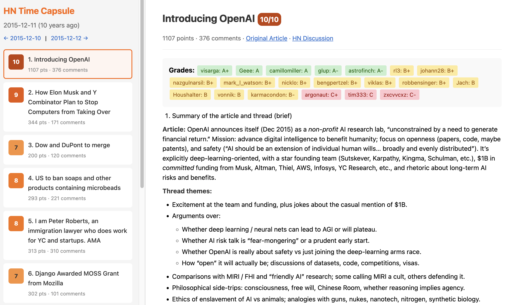

# HN Time Capsule



A Hacker News time capsule project that pulls the HN frontpage from exactly 10 years ago, analyzes articles and discussions using an LLM to evaluate prescience with the benefit of hindsight, and generates an HTML report. Also see [my short blog post about this repo](https://karpathy.bearblog.dev/auto-grade-hn/) for more context.

## What it does

1. Fetches the HN frontpage from 10 years ago (e.g., `https://news.ycombinator.com/front?day=2015-12-09`)
2. For each article, fetches the original article content and all HN comments
3. Generates prompts asking an LLM to analyze what happened with hindsight
4. Parses LLM responses to extract grades for each commenter
5. Renders an HTML summary with all analyses and grades

The goal is to find which HN commenters were most prescient or most wrong over time, and surface interesting predictions from a decade ago. The more general and interesting idea is that of LLMs automatically scouring human artifacts from the past and synthesizing them into knowledge and insights.

## Vibe code alert

99% of this repo was vibe coded in a few hours with Opus 4.5. Code is provided as is and I don't intend to support it.

## Setup

```bash
# Install dependencies
uv sync

# Set up OpenAI API key into a .env file
echo "OPENAI_API_KEY=your-key-here" > .env
```

## Usage

The main entry point is `pipeline.py` with 5 stages that can be run individually or all at once:

```bash
# Run all stages for today minus 10 years
uv run python pipeline.py all

# Run with a limit (for testing)
uv run python pipeline.py all --limit 5

# Run for a specific date
uv run python pipeline.py all --date 2015-06-15

# Run individual stages
uv run python pipeline.py fetch              # fetch frontpage + articles + comments
uv run python pipeline.py prompt             # generate LLM prompts
uv run python pipeline.py analyze            # run LLM analysis (costs money!)
uv run python pipeline.py parse              # extract grades from responses
uv run python pipeline.py render             # generate HTML summary

# Use a cheaper model for testing
uv run python pipeline.py analyze --model gpt-5-mini
```

## Data Directory Structure

```
data/
  2015-12-09/
    frontpage.json              # list of all articles from that day
    all_grades.json             # aggregated grades across all articles
    summary.html                # rendered HTML report
    10699846/                   # directory per article (by item_id)
      meta.json                 # article metadata
      article.txt               # fetched article content
      article_error.txt         # or error if fetch failed
      comments.json             # HN comment tree
      prompt.md                 # full LLM prompt
      response.md               # LLM analysis output
      grades.json               # parsed grades from response
```

## Files

- `pipeline.py` - Main pipeline with all stages (clean, fetch, prompt, analyze, parse, render)

## Example Output

The LLM analyzes each article and its discussion, then:
1. Summarizes what actually happened to the topic over 10 years
2. Awards "Most prescient" and "Most wrong" to commenters
3. Notes fun/notable aspects of the discussion
4. Grades each commenter (A+ to F) based on how their comments aged

Grades are parsed and aggregated in the Hall of Fame so we can track which HN accounts have the best prediction track records over time.

## License

MIT